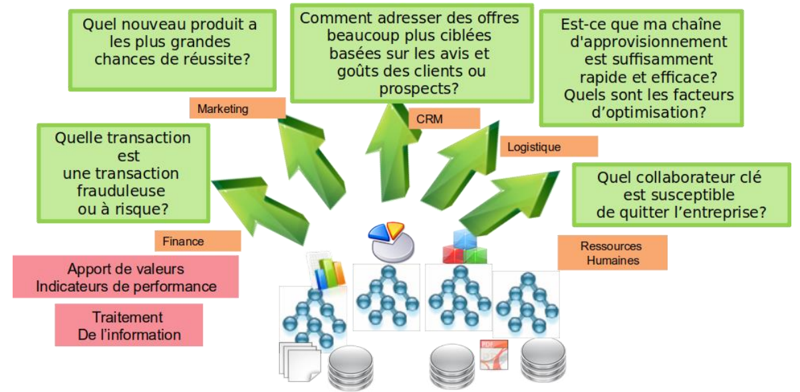
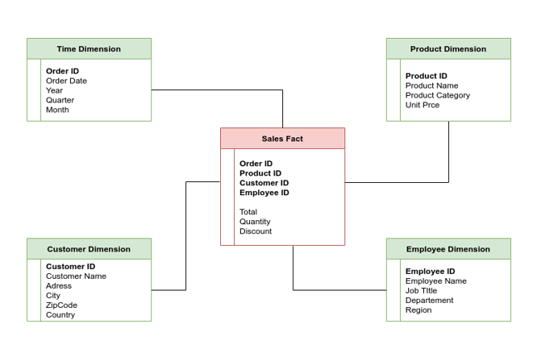
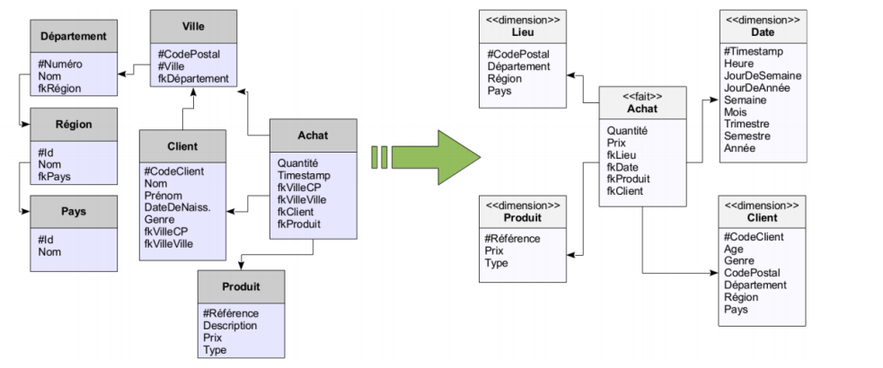
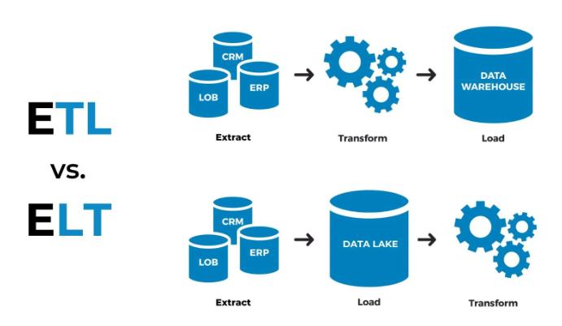
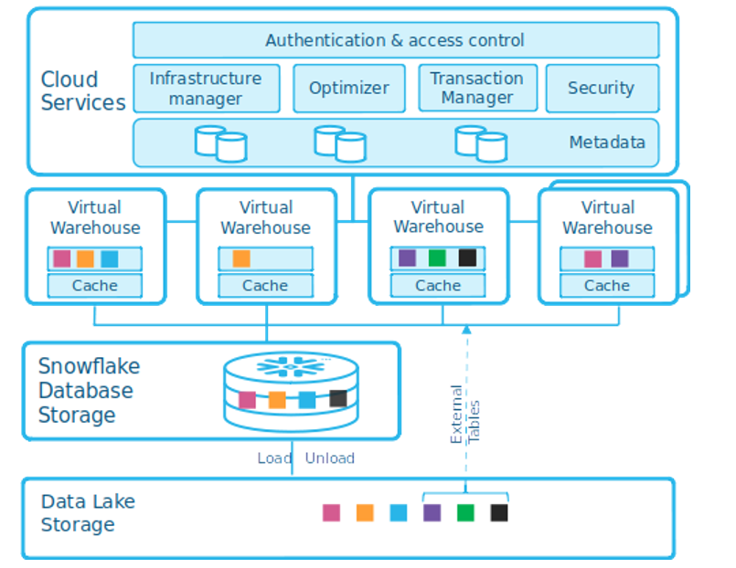
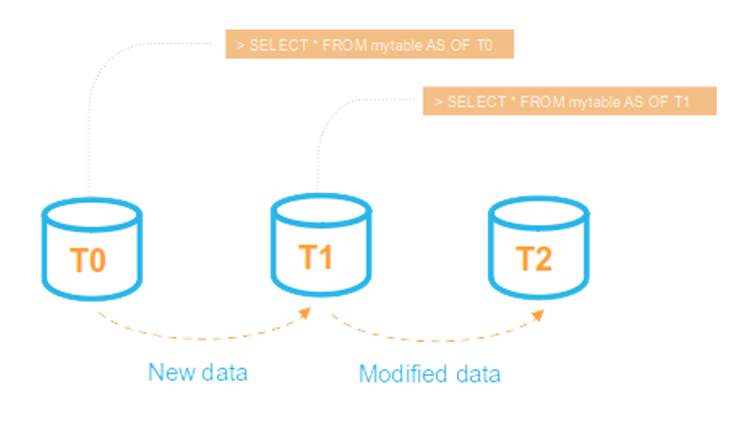
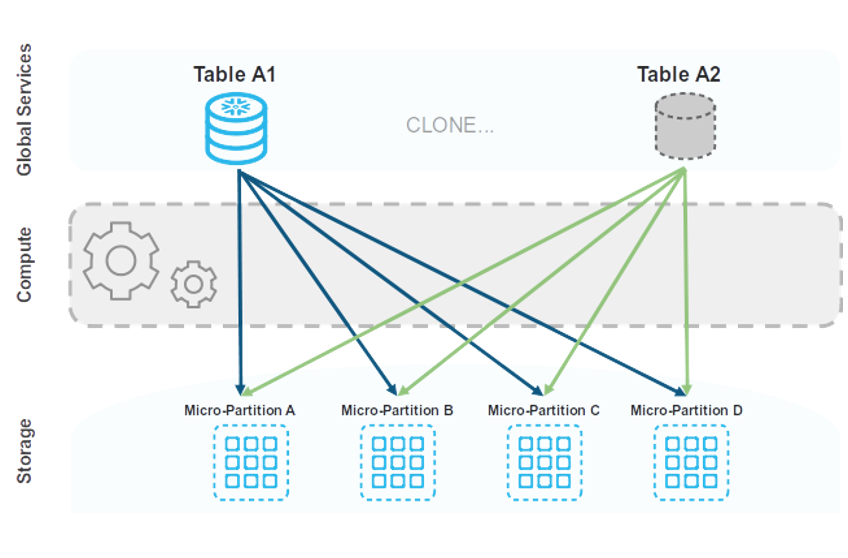

# Introduction: 
Les responsables d’entreprises sont aujourd'hui confrontés à la nécessité de prendre des décisions toujours plus rapides, toujours plus précises et toujours plus efficaces.  

Avec des stratégies adaptées et des logiciels performants, vous pouvez dès aujourd'hui prendre des décisions pilotées par les données – plus rapidement et avec une plus grande précision. On parle alors de **Business Intelligence**.  

**La Business Intelligence (BI) ou informatique décisionnelle** en français est un ensemble de processus, de technologies, de compétences et d'applications utilisés pour transmettre des informations pertinentes aux responsables et managers dans les sociétés. Elle vise à analyser des volumes de données considérables stockées dans les data warehouses et les convertir en informations exploitables.  

Les organisations qui mettent en place la Business Intelligence dans le processus de prise de décision adopte alors une stratégie dite **data-driven** (pilotée par la donnée).   

## Comment fonctionne la BI:  

Elle s’appuie sur la collecte de data, la mise en conformité de ces dernières, le contrôle de leur qualité, leur stockage dans ce qu’on appelle **un entrepôt de données** ou **data warehouse** et leur distribution aux acteurs concernés.  
Il regroupe les informations historiques et en temps réel de l’organisation afin d’obtenir une vision globale de l’activité.  
Grâce à l’ensemble de ces solutions, les équipes IT réalisent des études avancées et utilisent les renseignements collectés de manière opérationnelle et concrète.  

## Qu’est-ce que qu’un système d’information opérationnel:  

**Le système d'information opérationnel ou transactionnel** appelé aussi **OLTP (on-line
transaction processing)** représente les tâches quotidiennes, répétitives et atomiques
(Insertion, modification, suppression), il gère les opérations logiciels ou d’applications qui lisent,
écrivent de nouvelles informations et apportent des modifications en temps réel, par exemple
le traitement d’une commande, l’édition d’une facture, le suivi d’un colis, l’emballage d’une
production, la livraison d’un produit etc.

Les systèmes informatiques opérationnels sont conçus pour supporter et assister les opérations
d’une entreprise, ce sont **des systèmes de production ou de gestion** dans un environnement
informatique plus restreint décentralisés, on trouvera des systèmes pour la gestion des
ressources humaines, des systèmes pour la production, des CRM, des systèmes de facturation,
etc.  

Les systèmes OLTP sont souvent des systèmes disparates en termes de technologie utilisée. Il
n'est pas rare d'avoir dans une même entreprise une base de données MySQL pour gérer le
CRM et une base de données Oracle pour les Ventes.  

## Qu’est-ce que qu’un système d’information décisionnel?  
**Le système décisionnel** c’est un peu le contraire du **système opérationnel**, en effet pendant que
le monde opérationnel fait fonctionner l’entreprise, le monde décisionnel lui ne fait
qu’observer le fonctionnement de l’entreprise et agit ou prend des décisions en fonction de ce
qu’il observe. c’est la partie du système informatique qui par des méthodes, des processus, des
moyens et des outils informatiques va aider à piloter et à prendre des décisions dans une
entreprise, on parle alors de système d’aide à la prise de décision ou d’informatique
décisionnelle (BusinessIntelligence).  

Les systèmes décisionnels, également appelés **OLAP (on-line analytical
processing)**, s’intéressent aux tendances, aux moyennes, aux KPI (indicateurs de performances
clés), aux écarts type, aux indicateurs de croissances sur les mois et les années, les pays,… etc
Le système décisionnel OLAP en effet **analyse, prédit, conseil**, avec une vue d'ensemble des
données de l’entreprise pour mieux apprécier l’ensemble de l’activité.

## Enjeux des systèmes décisionnels et de l’exploitation des données: 

La prise de décisions stratégiques dans une organisation nécessite le recours et le croisement de
multiples informations qui concernent tous les départements : production, RH, DAF, achats,
ventes, marketing, service après-vente, maintenance, R&D...
Or ces données sont généralement :
* **Eparpillées** au sein des départements et non connectées entre elles,  
* **Hétérogènes** dans leurs formats techniques et leurs organisationsstructurelles, voire leurssémantiques
* **Implémentées pourl'action** (par construction) et non pour l'analyse,  
* **Volatiles**, au sens où leur mise à jour peut conduire à oublier des informations obsolètes,  

Les systèmes décisionnels permettent de faire l’analyse des activités déjà réalisées et d’en tirer
des enseignements pour les activités futures, pour cela ils utilisent des données de plusieurs
sources avec un **historique profond**(en moyenne 3 ans d'historique de données).  

Pour prendre de **« bonnes décisions »**, on doit pouvoir accéder aux données de l'entreprise,
traiter ces données, extraire l'information pertinente de ces données, par exemple pour savoir:
* Quels sont les résultats des ventes par gamme de produit et par région pour l'année dernière ?  
* Quelle est l'évolution des chiffres d'affaires par type de magasin et par période ?  
* Comment qualifierles acheteurs de mon produit X ? (Sexe, âge, ...).  

Les nouvelles attentes des SI pour répondre aux interrogations:  

* Considérer des quantités de données historisées de plus en plus importantes (Tera, Peta
octets), organisées selon différentes dimensions (temps, espace géographique, gammes de
produit, …).  
* Passer du traitement en ligne des données OLTP à l’analyse en ligne de ces données OLAP
selon différentes dimensions pour construire des indicateurs indispensables au pilotage de
l’entreprise

## Architecture décisionnelle (Business Intelligence):  

Il existe plusieurs architectures possibles pour un système décisionnel, l'architecture présentée
est constituée de 5 couches:  
* **Acquisition**: couche de traitement ETL permettant d'extraire, de transformer et charger les
données à partir du système opérationnel vers le système décisionnel.  
* **Centralisation**: couche de stockage contenant une base de données centralisée que l'on qualifie
de data Warehouse DWH.  
* **Distribution**: couche de traitement dont l'objectif est d'alimenter des partitions du DWH pour
les différentes applications qui seront exploitées pas les utilisateurs.  
* **Expostion**: couche de stockage dans une base de données contenant les données de distribution
que l'on qualifie de data marts.  
* **Restitution**: Couche constituée d'outils d'analyse ou de reporting servant d'interfaces entre les
utilisateurs et les données des data marts.  

## Introduction Data warehouse:  

**Un data warehouse (DW)** est une base de données construite par copie et réorganisation
de multiples sources (dont principalement le système transactionnel de l'entreprise), afin de
servir de source de données à des applications décisionnelles:  
* Il agrège de nombreuses données de l'entreprise (intégration);  
* Il mémorise les données dansle temps(historisation);  
* Il les organise pour faciliterles requêtes de prise de décision (optimisation).  

L'objectif du data warehouse est de répondre à des requêtes sur de grands ensembles des
données, la plupart du temps sous forme d'agrégats **(GROUP BY)** afin d'en obtenir une vision
synthétique (propre à la prise de décision).  

Le data warehouse dédié au décisionnel est séparé du système transactionnel dédié à la gestion
quotidienne.  

### Différence entre un data warehouse et une base de données transactionnelle:

**Base de données transactionnelle**: Une base données classique est destinée à assumer des
transactions en temps réel;  

* Ajout, mise à jour suppression de données  
* Questions sur des données identifiées  

**Un entrepôt de données (Data Warehouse)**: Un Data warehouse est une base de données analytique, uniquement destinée à l'exécution de requêtes sur des données statiques de questions statistiques(Faible mise à jour);  

* Ajout et agrégation de données  
* Questions statistiquessur des données historisées  

Le tableau suivant, liste les principales différences entre une base de données transactionnelle et un entrepôt de données.  

| Base de données transactionnelle           | Entrepôt de données              
|--------------------------------------------|-------------------------------------------|
| Orientée application                       | Orienté métiers                           |
| Données de détails                         | Données d'ensemble (agrégées)             |
| Orientée transaction                       | Orinetée analyse                          |
| Faible volume de données                   | Large volume de données                   |
| Hautement disponible                       | Tolére des petit arrêt de service         |
| Hautement performante en lecture/ecriture  | Latence faible                            |
| Données précise et à jour                  | Données historisées                       |
| Les données ne sont pas redandantes        | Les données peuvent être redandantes  |

## Introduction Data mart:  

**Les data marts** sont destinés à **pré-agréger des données** disponibles de façon plus détaillée dans
le **data warehouse**, afin à traiter plus facilement certaines questions spécifiques, critiques, etc.  

**Exemple** : ticket de caisse d’un super marché.  

Si un data warehouse enregistre un ensemble de ventes d'articles avec un **grain très fin**, un data
mart peut faciliter une analyse dite de ticket de caisse (co-occurrence de ventes de produits par
exemple) en adoptant un grain plus grossier (nombre de ventes par jour, chiffre d'affaires par
famille de produit, ...etc),  

Les data marts sont en quelque sorte une vues métier, ils sont considérés comme des espaces
d'analyse, du fait que les données sont moins volumineuses et surtout qu'elles sont
thématiques.  

**Un data warehouse et un data mart** se distinguent par le
spectre qu'il recouvre :
* Le data warehouse recouvre l'ensemble des données et
problématiques d'analyse visées par l'entreprise.
* Le data mart recouvre une partie des données et
problématiques liées à un métier ou un sujet d'analyse en
particulier. Un data mart est souvent un sous-ensemble du data warehouse de l'entreprise, obtenu par extraction et agrégation des données de celui-ci.  

Si un data warehouse enregistre l'ensemble des transactions de site e-commerce avec un grain très fin, un data mart peut
faciliter une analyse des ventes en adoptant un grain plus
grossier(les ventes par produit, par jours, ...).  

## Modélisation d’un Data warehouse

La modélisation des données dans un entrepôt de données est la pierre angulaire de l'informatique décisionnelle. Elle s'appuie sur des concepts permettant d'optimiser la
restitution des données, selon les différents axes métiers de l´entreprise.  

Permet de présenter les données sous une forme standardisée et intuitive.  

Les données sont organisées de manière à mettre en évidence les perspectives de l'analyse.  

Les principaux modèles de conception d'un data wrehouse sont:
* Le modèle en étoile
* Le modèle en flocon
* Le modèle en constellation

### Modèle en Etoile:  

Le modèle en étoile est une représentation 
fortement dénormalisée qui assure un haut 
niveau de performance des requêtes même sur 
de gros volumes de données.
* **Une table de faits** : identifiants des tables de 
dimension ; une ou plusieurs mesures .
* **Plusieurs tables de dimension** : descripteurs des 
dimensions.

* **Une table de faits**: Les faits sont indicateurs sur
quoi va porter l'analyse. C’est une table qui
contient des informations qui relatent la vie de
l'entreprise. Une table de faits pour les ventes
va contenir (chiffre d'affaire net, quantités et
montants commandés, quantités facturées,
quantités retournées, volumes des ventes, etc.)
par exemple,
Contient deux types de colonnes:
* Clés étrangères vers les tables de dimensions
* Valeurs numériques souvent additives(mesures)
La clé primaire est typiquement une clé
composée, formée d'un sous-ensemble des clés
étrangères vers les tables de dimensions.

* **Plusieurs tables de dimension**: On entend par dimensions les axes avec lesquels on veut faire
l'analyse. Il peut y avoir une dimension client, une dimension produit, une dimension géographie
(pour faire des analyses par secteur géographique), etc.
Les tables de dimensions sont des ensembles d'attributs regroupées selon les objets clés de
l'entreprise: Produit, Client, Employé, Géographie, …
Les attributs sont:
* Descriptif ( ex: nom produit, date naissance client, …)
* De qualité (Pas de valeur manquante, obsolète ou erronée)
* Principalement des valeurs discrètes(jour, âge client, prix produit)
* Leur srôles sont utilisés pour Filtrer, restreindre, étiqueter.  

La puissance analytique de l'entrepôt est proportionnelle à la richesse et la qualité des attributs dimensionnels.

**Avantages:**
--------------
* Facilité de navigation
* Performances : nombre de jointures limité ;
* Gestion des agrégats
* Fiabilité des résultats

**Inconvénients:**
-----------------
* Toutesles dimensions ne concernent pasles mesures
* Redondancesdans les dimensions
* Alimentation complexe.

### Modèle en flocon:  
Le modèle en flocons de neige est aussi une 
structure dans laquelle une seule table de
faits est entourée par plusieurs tables de
dimensions. Cependant certaines dimensions
sont à niveaux multiples.
Le schéma en flocons est conçu pour
répondre à des requêtes sur une dimension
ayant des relations complexes (Ex: un produit
peut appartenir à plusieurs catégories).  

**Modèle en flocon = modèle en étoile +
normalisation des dimensions.**

  

**Avantages:**
-------------  
* réduction du volume,
* permettre des analyses par pallier(drill down) sur la dimension hiérarchisée.  

**Inconvénients:**
-----------------
* Schéma moins intuitif
* navigation difficile
* nombreuses jointures
* Dégradation des performances à cause des jointures additionnelles.  

### Modèle en constellation:  
**La modélisation en constellation** consiste à fusionner plusieurs modèles en étoile qui utilisent
des dimensions communes. Un modèle en constellation
comprend donc plusieurs tables de faits et des tables de
dimensions communes ou non à ces tables de faits.  

  

**Avantages:**
--------------
* Facilité de navigation
* Performances : nombre de jointures limité
* Gestion des agrégats
* Fiabilité desrésultats  

**Inconvénients:**
------------------
* Toutes les dimensions ne concernent pas les mesures
* Redondances dans les dimensions
* Alimentation complexe  

## Concepts de base d’un process ETL:  

**L'ETL (Extraction Transformation Loading)** est le processus de copie des données depuis les tables des systèmes transactionnels vers les tables du modèle décisionnel du data warehouse.  

  

L’ETL est un outil fondamental pour la construction des entrepôts de données.  
* Il permet d’extraire les données des systèmes hétérogènes sources, les normalisent et les rendent
cohérente entre elles pour qu’elles puissent être utilisées ensemble.  
* Il permet également l’exécution des opérations de transformations de données selon les exigences de
l’organisation dans une base de données de destination, charger les données dans une unique destination de base de données.  

L’étape d’ETL constitue en moyenne **70%** d’un projet décisionnel, car ce système est complexe et
ne doit rien laisser s’échapper sous peine d’avoir une mauvaise information dans l’entrepôt de
données .  
Le but étant de faire rentrer toutes les données de l’entreprise dans un modèle de données (Data
Warehouse), ces données doivent être :

* **Dénormaliser** : dans un Data Warehouse, avoir des doublons n'est pas important, avoir un schéma
en troisième forme normale est même déconseillé. Il faut que les données apparaissent là où elles
doivent apparaître. (Ex: un produit appartenant à plusieurs catégorie).  
* **Nettoyer** : dans un système de transactionnel, les utilisateurs entrent les données. Les risques
d'erreurs sont là : entrer la rue au lieu du pays, écrire Belgie au lieu de Belgique. Ces erreurs ont des
répercussions directes sur les analyses (les commandes avec Belgie comme pays ne feront pas partie
des commandes faites en Belgique). Il faut pouvoir détecter et corriger ces erreurs.  
* **Contextualiser** : imaginez un système de paie où les informations sur l'activité et la paie des
employés sont enregistrées, et un système de RH ou les informations personnelles des employés sont
stockées. Un entrepôt de données possède une vision universelle, un employé est un employé, et il
n'y aura qu'une seule dimension "Employé" avec toutes les informations le concernant.  
* **Charger dans le Data Warehosue** : c'est l'étape la plus complexe, il s'agit ici d'ajouter les nouvelles lignes,
voir si des lignes ont été modifiées et faire une gestion d'historique, voir si des lignes ont été
supprimées et de le mentionner dans l'entrepôt, tout en faisant attention de ne pas charger plusieurs
fois la même donnée.  

## Choisir un outil ETL:

  

Pour bien choisir une solution ETL, plusieurs critères sont à considérer:
1. L'indépendance aux différents OS: Linux, Windows, AIX,…
2. Les différents connecteurs aux sources de données (SGBD, fichiers, FTP, Web Service, …)
3. Les différents composants pour manipuler les données (Filter, Join, Transform, Sort, …)
4. Capacité à faire appel à un langage de scripting (Perl, Python, VB, …)
5. L'ouverture à des langages de programmation (Java, C++, C#, …)
6. Ergonomie des interfaces graphiques
7. Sécurisation des données (Chiffrement, anonymisation, masking)
8. Les coûts des licences logicielles, infrastructure, formation et support.

## Concepts de base d’un process ELT:  

Comme son nom l’indique, l’ELT consiste à charger les données dans un entrepôt de données avant d’y appliquer les éventuels traitements.  

Cette méthode est une alternative de l’ETL. Cette dernière extrait les données depuis la source vers une machine de traitement (Spark, snowflake, Bigquery, etc…) puis une fois le traitement effectué déplace une nouvelle fois les données vers les bases de données d’exposition.  

Comprenons rapidement les différences entre ces deux méthodes.  

### ELT vs ETL:  

Dans ces deux méthodes on commence par l’extraction des données provenant d’une ou plusieurs sources : API, base de données, ERP, fichiers plats...  

### Résumé des différences : ETL versus ELT
|Catégorie   | ETL   | ELT    |
-------------|-------|--------|
| Signification | Extraction, transformation et chargement |
Extraction, chargement et transformation |  
| Traitement |   Prend des données brutes, les transforme dans un format prédéterminé, puis les charge dans l'entrepôt de données cible. | Prend des données brutes, les charge dans l'entrepôt de données cible, puis les transforme juste avant l'analyse. |
| Lieux de transformation et de chargement | La transformation s'effectue sur un serveur de traitement secondaire. | 
La transformation a lieu dans l'entrepôt de données cible. |
| Compatibilité des données | Idéal avec des données structurées. | Peut gérer des données structurées, non structurées et semi-structurées. |  
| Rapidité | L'ETL est plus lent que l'ELT. | L'ELT est plus rapide que l'ETL, car il peut utiliser les ressources internes de l'entrepôt de données. |
| Coûts | La configuration peut être longue et coûteuse en fonction des outils ETL utilisés. | Plus rentable en fonction de l'infrastructure ELT utilisée. |
| Sécurité | Peut nécessiter la création d'applications personnalisées pour répondre aux exigences de protection des données.| Vous pouvez utiliser les fonctionnalités intégrées de la base de données cible pour gérer la protection des données. |

## Introcution to Snowflake (Modern Data Warehouse):    

Snowflake est une plateforme d’entrepôt de données en mode SaaS qui centralise, dans le cloud, le stockage et le traitement de données structurées et semi-structurées. La génération croissante de données produites dans le monde entier nécessite une infrastructure moderne pour traiter les données. 

Conçu de A à Z, Snowflake tire parti de l'élasticité offerte par le cloud et est véritablement révolutionnaire à tous égards.  
L'élasticité du cloud est au cœur de Snowflake, ce qui rend son architecture unique et sa proposition de valeur difficiles à concurrencer sur le marché.  

### Concepts clés et architecture:  

Snowflake combine un tout nouveau moteur d’interrogation SQL avec une architecture novatrice, conçue spécialement pour le Cloud. Pour l’utilisateur, Snowflake offre toutes les fonctionnalités d’une base de données analytique d’entreprise, ainsi que de nombreuses autres fonctionnalités spéciales et des capacités uniques.  

Snowflake est un véritable service autogéré, ce qui signifie :

* Il n’y a aucun matériel (virtuel ou physique) à sélectionner, installer, configurer ou gérer.

* Il n’y a pratiquement aucun logiciel à installer, à configurer ou à gérer.

* La maintenance, la gestion, les mises à jour et les réglages sont assurés par Snowflake.  

L’architecture unique de Snowflake se compose de trois couches clés :

* Stockage de bases de données

* Traitement des requêtes

* Services Cloud

#### Stockage de bases de données:
Lorsque les données sont chargées dans Snowflake, Snowflake réorganise ces données dans son format interne optimisé, compressé et en colonnes. Snowflake stocke ces données optimisées dans le stockage Cloud.  

Snowflake gère tous les aspects du stockage de ces données : l’organisation, la taille des fichiers, la structure, la compression, les métadonnées, les statistiques, etc. Les objets de données stockés par Snowflake ne sont ni directement visibles ni directement accessibles par les clients. Ils ne sont accessibles que par des opérations de requête SQL exécutées avec Snowflake.  

#### Traitement des requêtes:
L’exécution de la requête s’effectue dans la couche de traitement. Snowflake traite les requêtes à l’aide « d’entrepôts virtuels ». Chaque entrepôt virtuel est une grappe de calcul à traitement massivement parallèle (MPP) composée de plusieurs nœuds de calcul alloués par Snowflake à partir d’un fournisseur Cloud.  

Chaque entrepôt virtuel est une grappe de calcul indépendante qui ne partage aucune ressource de calcul avec d’autres entrepôts virtuels. Par conséquent, chaque entrepôt virtuel n’a aucune conséquence sur les performances des autres entrepôts virtuels.  

#### Services Cloud:
La couche de services Cloud constitue un ensemble de services qui coordonnent les activités dans Snowflake. Ces services relient tous les différents composants de Snowflake afin de traiter les demandes des utilisateurs, de la connexion à l’envoi des requêtes. La couche de services Cloud s’exécute également sur des instances de calcul fournies par Snowflake à partir du fournisseur Cloud.

* Les services gérés dans cette couche comprennent :

* Authentification

* Gestion de l’infrastructure

* Gestion des métadonnées

* Analyse syntaxique et optimisation des requêtes

* Contrôle d’accès

#### Virtual warehouses:  

Un Virtual warehouses ou entrepôt virtuel, souvent appelé simplement « entrepôt », est un cluster de ressources de calcul dans Snowflake.  

Un Virtual warehouses fournit les ressources requises, telles que le processeur, la mémoire et le stockage temporaire, pour effectuer les opérations suivantes dans une session Snowflake :

* Exécuter des instructions SQL SELECT qui nécessitent des ressources de calcul (par exemple, récupérer des lignes à partir de tables et de vues).  

* Effectuer des opérations DML, telles que :  
    *   Mise à jour des lignes dans les tableaux (DELETE , INSERT , UPDATE).

    * Chargement des données dans des tables (COPY INTO <table>).

    * Déchargement des données des tables (COPY INTO <emplacement>).

### Connexion à Snowflake:  
Snowflake prend en charge plusieurs méthodes de connexion au service :  

* Une interface utilisateur Web à partir de laquelle il est possible d’accéder à tous les aspects de la gestion et de l’utilisation de Snowflake.

* Des clients de ligne de commande (p. ex. SnowSQL) qui peuvent également accéder à tous les aspects de la gestion et de l’utilisation de Snowflake.

* Des pilotes ODBC et JDBC qui peuvent être utilisés par d’autres applications (p. ex. Tableau) pour se connecter à Snowflake.

* Des connecteurs natifs (p. ex. Python, Spark) qui peuvent être utilisés pour développer des applications de connexion à Snowflake.

* Des connecteurs tiers qui peuvent être utilisés pour connecter des applications, telles que des outils ETL (p. ex. Informatica) et des outils BI (comme ThoughtSpot) à Snowflake.

#### Time Travel for data:

* Versions précédentes des données automatiquement conservées. La durée de conservation sélectionnée par le client.  

* Accessible via les extensions SQL
* AS OF pour la sélection
* CLONE pour la recréer
* UNDROP récupère après une suppression accidentelle

#### Zero-Copy Cloning:  

Crée une copie d'un objet existant dans le système. Cette commande est principalement utilisée pour créer des clones sans copie de bases de données, de schémas et de tables.  

* Crée une copie indépendante des données pour les expériences

* Minimise la duplication des données

* Intégré au contrôle d'accès basé sur les rôles de Snowflake

### Éditions Snowflake: 

Snowflake propose plusieurs éditions au choix, garantissant que votre utilisation correspond aux besoins spécifiques de votre organisation. Chaque édition successive s’appuie sur l’édition précédente en ajoutant des fonctionnalités spécifiques à l’édition et/ou des niveaux de service supérieurs. À mesure que les besoins de votre entreprise évoluent et grandissent, passer à une autre édition se fait en toute simplicité.  

#### Standard Edition:
Standard Edition est notre offre de niveau d’introduction, offrant un accès complet et illimité à toutes les fonctions standard de Snowflake. Elle fournit un équilibre solide entre les fonctionnalités, le niveau d’assistance et le coût.

#### Enterprise Edition:
Enterprise Edition offre tous les services et fonctions de Standard Edition avec des fonctions supplémentaires conçues spécialement pour répondre aux besoins des entreprises et organisations de grande envergure.

#### Business Critical Edition:
Business Critical Edition, anciennement appelé Enterprise for Sensitive Data (ESD), offre une protection accrue des données afin de faire face aux besoins des entreprises possédant des données extrêmement sensibles, plus particulièrement des informations de santé protégées PHI devant respecter les lois HIPAA et HITRUST CSF .