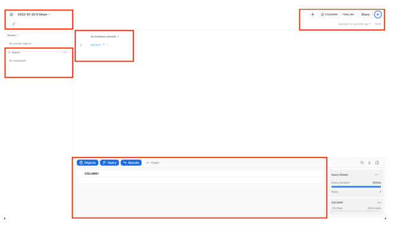
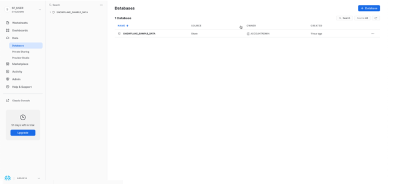
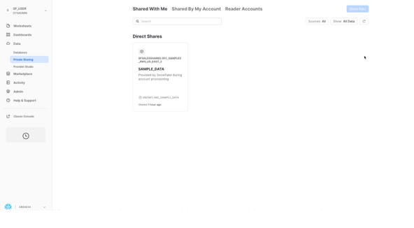
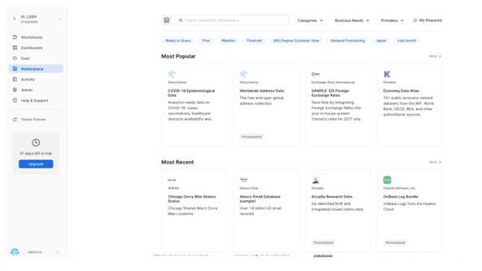
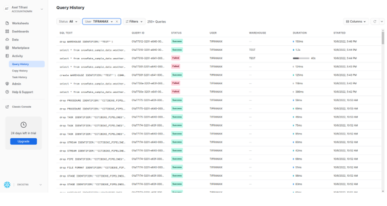
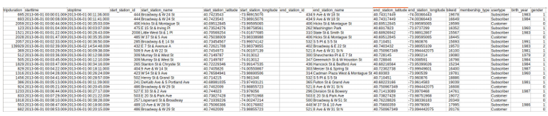

# Présentation du lab 1:

Ce premier lab vous présente l'interface utilisateur et les fonctionnalités de base de Snowflake. Il est spécialement conçu pour être utilisé avec Snowflake, essai gratuit de 30 jours sur https://trial.snowflake.com. Une fois le laboratoire terminé, vous devriez être prêt à charger vos propres données dans Snowflake et à découvrir ses fonctionnalités plus avancées.

## Conditions préalables:  
* Utilisation de l'environnement d'essai gratuit de 30 jours de Snowflake.  
* Connaissance de base de SQL et des concepts et objets de bases de données.  
* Familiarité avec les fichiers CSV délimités par des virgules et les données semi-structurées JSON.  

## Préparez votre environnement de lab:

Si ce n'est pas encore fait, inscrivez-vous pour un essai gratuit de Snowflake de 30 jours sur https://trial.snowflake.com.  
L'édition Snowflake (Standard, Enterprise, Business Critical, etc.), pour ce lab choisissez **Entreprise Edition**.  
Les fournisseurs de cloud (AWS, Azure, GCP), pour ce lab choisissez et la région **Europe (Irlande) eu-west-1**.     
Après votre inscription, vous recevrez un e-mail avec un lien d'activation et une URL pour accéder à votre compte Snowflake.  

### Connexion à l'interface utilisateur (UI) de Snowflake:

Ouvrez une fenêtre de navigateur et saisissez l'URL de votre environnement d'essai de 30 jours Snowflake qui a été envoyée avec votre e-mail d'inscription.
Vous devriez voir la boîte de dialogue de connexion suivante. Saisissez le nom d'utilisateur et le mot de passe que vous avez spécifiés lors de l'inscription :

### Navigation dans l'interface utilisateur de Snowflake:  

Cette section couvre les composants de base de l'interface utilisateur. Nous allons nous déplacer de haut en bas sur la marge de gauche.   

L'onglet Feuilles de calcul **Worksheets** fournit une interface pour soumettre des requêtes SQL, effectuer des opérations DDL (Data Definition Language) et DML (Data Mapinulation Language) et afficher les résultats à mesure que vos requêtes ou opérations se terminent. Une nouvelle feuille de calcul est créée en cliquant sur + Feuille de calcul en haut à droite.  

Le coin supérieur gauche contient les éléments suivants :  
* **Icône d'accueil (Home)** : utilisez-la pour revenir à la console principale/fermer la feuille de calcul.
* **Liste déroulante Worksheet_name** : le nom par défaut est l'horodatage de la création de la feuille de calcul. Cliquez sur l'horodatage pour modifier le nom de la feuille de calcul. La liste déroulante affiche également les actions supplémentaires que vous pouvez effectuer pour la feuille de calcul.    

Le coin supérieur droit contient les éléments suivants :  
* **Zone contextuelle (Context box)**: cela permet à Snowflake de savoir quel rôle et quel entrepôt utiliser pendant cette session. Il peut être modifié via l'interface utilisateur ou les commandes SQL.
* **Bouton Partager (Share)** : ouvrez le menu de partage pour partager avec d’autres utilisateurs ou copiez le lien vers la feuille de calcul.
* **Bouton Lecture/Exécuter (Play/Run)** : exécutez l'instruction SQL à l'endroit où se trouve actuellement le curseur ou plusieurs instructions sélectionnées.

Le volet du milieu contient les éléments suivants :  
Liste déroulante en haut pour définir le contexte de **base de données/schéma/objet** pour la feuille de calcul.  
Zone de travail générale dans laquelle vous saisissez et exécutez des requêtes et d'autres instructions SQL.  

Le volet inférieur affiche les résultats des requêtes et autres opérations. Comprend également 4 options **(Objet, Requête, Résultat, Graphique)**.   

L'onglet Tableaux de bord **Dashboards** vous permet de créer des affichages flexibles d'un ou plusieurs graphiques. Les vignettes et les widgets sont produits en exécutant des requêtes SQL qui renvoient les résultats dans une feuille de calcul.  

Sous Données **Data**, l'onglet Bases de données **Databases** affiche des informations sur les bases de données que vous avez créées ou auxquelles vous êtes autorisé à accéder. Vous pouvez créer, cloner, supprimer ou transférer la propriété de bases de données, ainsi que charger des données dans l'interface utilisateur.

Également sous Données **Data**, l'onglet Données partagées privées **Private Shared Data** est l'endroit où le partage de données peut être configuré pour partager facilement et en toute sécurité des tables Snowflake entre des comptes Snowflake distincts ou des utilisateurs externes, sans avoir à créer une copie des données. Nous aborderons le partage de données dans la autre section.  

L'onglet **Marketplace** est l'endroit où tout client Snowflake peut parcourir et consommer les ensembles de données mis à disposition par les fournisseurs. Il existe deux types de données partagées : publiques et personnalisées. Les données publiques sont des ensembles de données gratuits disponibles pour une interrogation instantanée. Les données personnalisées nécessitent de contacter le fournisseur de données pour obtenir l'approbation du partage des données.  

Sous Activité, il y a deux onglets Historique des requêtes et Historique des copies :  

* **Query History** est l'endroit où les requêtes précédentes sont affichées. Affichez les détails de toutes les requêtes exécutées au cours des 14 derniers jours à partir de votre compte Snowflake. Cliquez sur un ID de requête pour y accéder et obtenir plus d'informations.  
* **Copy History** affiche l'état des commandes de copie exécutées pour ingérer des données dans Snowflake.  
Sous **Admin**, l'onglet Entrepôt est l'endroit où vous configurez et gérez les ressources de calcul appelées entrepôts virtuels pour charger ou interroger des données dans Snowflake.

Également sous **Admin**,

* L'onglet Moniteurs de ressources **Resource Monitors** affiche tous les moniteurs de ressources qui ont été créés pour contrôler le nombre de crédits consommés par les entrepôts virtuels.  
Le sous-onglet **Roles** de l'onglet **Users** et **roles** affiche une liste des rôles et de leurs hiérarchies. Les rôles peuvent être créés, réorganisés et accordés aux utilisateurs dans cet onglet.

**ACCOUNTADMIN:**  
Pour la plupart de ces ateliers, vous resterez dans le rôle ACCOUNTADMIN qui dispose des privilèges nécessaires pour créer des entrepôts, des bases de données et d'autres objets dans un compte.  
Dans un environnement réel, vous utiliserez différents rôles pour les tâches de cet atelier et attribuerez les rôles à vos utilisateurs.

### Préparation du chargement des données
Commençons par préparer le chargement des données structurées des transactions des cyclistes Citi Bike dans Snowflake.
Cette section vous guide à travers les étapes pour :
* Créez une base de données et une table.
* Créez un stage externe.
* Créer un format de fichier pour les données.  
Obtenir des données dans Snowflake, Il existe de nombreuses façons d'obtenir des données dans Snowflake à partir de nombreux emplacements, notamment la commande COPY, l'ingestion automatique Snowpipe, des connecteurs externes ou des solutions ETL/ELT tierces. Pour plus d'informations sur l'importation de données dans Snowflake, consultez la documentation de Snowflake.  
Pour les besoins de cet atelier, nous utilisons la commande **COPY** et le stockage **AWS S3** pour charger les données manuellement. Dans un scénario réel, vous utiliseriez plus probablement un processus automatisé ou une solution ETL.

Les données que nous utiliserons sont des données de partage de vélos fournies par Citi Bike NYC. Les données ont été exportées et prédéfinies pour vous dans un compartiment Amazon AWS S3 dans la région EU-WEST-1.  
Les données comprennent des informations sur les temps de trajet, les emplacements, le type d'utilisateur, le sexe, l'âge, etc. Sur AWS S3, les données représentent 61,5 millions de lignes, 377 objets et 2 Go compressés.  
Vous trouverez ci-dessous un extrait de l'un des fichiers de données CSV de Citi Bike :

