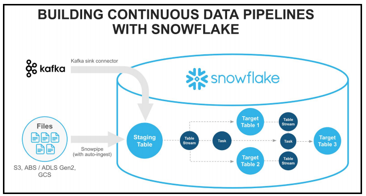
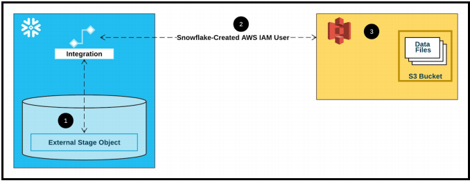

# Présentation du lab 2:  
Ce second lab démontre les fonctionnalités de Snowflake spécifiquement adaptées à la charge de travail « Data Engineering » pour créer des pipelines de données modernes. Les pipelines de données automatisent de nombreuses étapes manuelles impliquées dans la transformation et l'optimisation des charges de données continues.   

Snowflake fournit les fonctionnalités suivantes pour activer des pipelines de données continus :  
* Chargement continu des données à l'aide de Snowpipe,  
* Modifier le suivi des données à l'aide de Streams,  
* Tâches (TASKS) récurrentes.  

L'image ci-dessous illustre comment créer des pipelines de données continus avec Snowflake.  


  

## Qu’est-ce que Snowpipe ?

* Permet le chargement une fois qu'un fichier apparaît dans un bucket.  
* Si les données doivent être disponibles immédiatement pour analyse.  
* Snowpipe utilise des fonctionnalités Serveless (exemple AWS SQS) en plus du virtual warehouses.  

## Qu’est-ce que les streams et tasks ?

Les Streams et les tasks sont des fonctionnalités qui vous permettent de créer des pipelines de données et de transformer Snowflake en un moteur transformation de données agile en plus d’un puissant entrepôt de données.  

* les tasks peuvent être utilisées pour planifier des instructions SQL.  

## Snowflake Storage integration:

Une intégration de stockage **(Storage integration)** est un objet Snowflake qui stocke les informations d'identification et d'accès (IAM) pour votre stockage Cloud externe, ainsi qu’un ensemble facultatif d’emplacements de stockage autorisés ou bloqués (Amazon S3, Google Cloud Storage ou Microsoft Azure).

* Syntaxe:  https://docs.snowflake.com/fr/sql-reference/sql/create-storage-integration 

```
CREATE [ OR REPLACE ] STORAGE INTEGRATION [IF NOT EXISTS]
  <name>
  TYPE = EXTERNAL_STAGE
  cloudProviderParams
  ENABLED = { TRUE | FALSE }
  STORAGE_ALLOWED_LOCATIONS = ('<cloud>://<bucket>/<path>/' [ , '<cloud>://<bucket>/<path>/' ... ] )
  [ STORAGE_BLOCKED_LOCATIONS = ('<cloud>://<bucket>/<path>/' [ , '<cloud>://<bucket>/<path>/' ... ] ) ]
  [ COMMENT = '<string_literal>' ]
```

Un rôle  et un strategie IAM sont nécessaires pour exécuter cette commande SQL.


## Configuration de l'accès sécurisé à Amazon S3:  

Cette section décrit comment utiliser les intégrations de stockage **Storage integration* pour permettre à Snowflake de lire et d'écrire des données dans un compartiment Amazon S3 référencé dans une étape externe (c'est-à-dire S3).  

Le diagramme suivant montre le flux d'intégration pour une étape S3 :    

  

### Liste des étapes pour cette section :  

* Étape 1 : configurer les autorisations d'accès pour le compartiment S3  
    * Exigences du contrôle d'accès AWS  
    * Création d'une stratégie IAM  
* Étape 2 : Créer le rôle IAM dans AWS  
* Étape 3 : Créer une intégration de stockage cloud dans Snowflake  
* Étape 4 : Récupérer l'utilisateur AWS IAM pour votre compte Snowflake  
* Étape 5 : Accorder à l'utilisateur IAM les autorisations d'accès aux objets du compartiment S3  

Vous avez pas besoin de créer votre propre bucket S3. Le bucket qui sera utilisé dans ce lab est ** logbrain-private-datalake **. Les données seront sotckées dans le dossier **  citibike_snowpipe **.   

* Pour Configurer les autorisations d'accès pour le bucket S3. [AWS]
    Suivez les instructions décrites dans la documentation Snowflake en utilisant le lien ci-dessous.  
    https://docs.snowflake.com/en/user-guide/data-load-s3-config-storage-integration.html#step-1-configure-access-permissions-for-the-s3-bucket  

* Pour créer un role IAM,  [AWS]
    Suivez les instructions décrites dans la documentation Snowflake en utilisant le lien ci-dessous. 
    https://docs.snowflake.com/en/user-guide/data-load-s3-config-storage-integration#step-2-create-the-iam-role-in-aws  
 

* Create a Cloud Storage Integration in Snowflake.   

1. Create the database and grant access to the new role create :
```
CREATE DATABASE IF NOT EXISTS MANAGE_DB;
```

Switch Context:
```
USE MANAGE_DB.PUBLIC;
USE WAREHOUSE DATAPIPELINES_WH;
```

2. Switch Context:  
```
USE ROLE ACCOUNTADMIN;
```
3. Create the Warehouse:  
```
CREATE WAREHOUSE IF NOT EXISTS DATAPIPELINES_WH
    WITH WAREHOUSE_SIZE = 'XSMALL' 
    AUTO_SUSPEND = 60 
    AUTO_RESUME = TRUE;
```
4. Create Cloud Storage Integration:  

```
create or replace storage integration s3int
type = external_stage
storage_provider = s3
enabled = true
storage_aws_role_arn = 'arn:aws:iam:xxxx
storage_allowed_locations = ('s3://bucketname/');
```

-- Récupérez l'utilisateur AWS IAM pour votre compte Snowflake et enregistrez les valeurs suivantes à partir de l'instruction SQL ci-dessous :     
-- STORAGE_AWS_IAM_USER_ARN   
-- STORAGE_AWS_EXTERNAL_ID   

5. Describe the storage integration: 

```
DESC INTEGRATION citibike_snowpipe_integration;
```

6. Create table first
```
CREATE OR REPLACE TABLE MANAGE_DB.PUBLIC.movie_titles (
  show_id STRING,
  type STRING,
  title STRING,
  director STRING,
  cast STRING,
  country STRING,
  date_added STRING,
  release_year STRING,
  rating STRING,
  duration STRING,
  listed_in STRING,
  description STRING )
```
7. Create file format object
```
CREATE OR REPLACE file format MANAGE_DB.file_formats.csv_fileformat
    type = csv
    field_delimiter = ','
    skip_header = 1
    null_if = ('NULL','null')
    empty_field_as_null = TRUE;
```
    
 8. Create stage object with integration object & file format object
 ```
CREATE OR REPLACE stage MANAGE_DB.external_stages.csv_folder
    URL = 's3://<your-bucket-name>/<your-path>/'
    STORAGE_INTEGRATION = s3_int
    FILE_FORMAT = MANAGE_DB.file_formats.csv_fileformat
```

9. Use Copy command   
```    
COPY INTO MANAGE_DB.PUBLIC.movie_titles
    FROM @MANAGE_DB.external_stages.csv_folder
``` 
    
10. Create file format object
```
CREATE OR REPLACE file format MANAGE_DB.file_formats.csv_fileformat
    type = csv
    field_delimiter = ','
    skip_header = 1
    null_if = ('NULL','null')
    empty_field_as_null = TRUE    
    FIELD_OPTIONALLY_ENCLOSED_BY = '"'    
      
SELECT * FROM MANAGE_DB.PUBLIC.movie_titles
```
    
## Snowpipe:

1. Create table first
```
CREATE OR REPLACE TABLE MANAGE_DB.PUBLIC.employees (
  id INT,
  first_name STRING,
  last_name STRING,
  email STRING,
  location STRING,
  department STRING
  )
```
    
2.Create file format object
```
CREATE OR REPLACE file format MANAGE_DB.file_formats.csv_fileformat
    type = csv
    field_delimiter = ','
    skip_header = 1
    null_if = ('NULL','null')
    empty_field_as_null = TRUE;
```
    
    
 3. Create stage object with integration object & file format object
 ```
CREATE OR REPLACE stage MANAGE_DB.external_stages.csv_folder
    URL = 's3://snowflakes3bucket123/csv/snowpipe'
    STORAGE_INTEGRATION = s3_int
    FILE_FORMAT = MANAGE_DB.file_formats.csv_fileformat
```

 4. Create stage object with integration object & file format object
 ```
LIST @MANAGE_DB.external_stages.csv_folder  
```

5. Create schema to keep things organized
```
CREATE OR REPLACE SCHEMA MANAGE_DB.pipes
```

6. Define pipe
```
CREATE OR REPLACE pipe MANAGE_DB.pipes.employee_pipe
auto_ingest = TRUE
AS
COPY INTO MANAGE_DB.PUBLIC.employees
FROM @MANAGE_DB.external_stages.csv_folder  
```

7. Describe pipe
```
DESC pipe employee_pipe
```
```
SELECT * FROM MANAGE_DB.PUBLIC.employees    
```

8. Configure notification:  

Review the Snowpipe definition and make a note of the notification channel value.   

```
show pipes;
```

Copy the SQS notification Arn to the bucket notification sqs arn ** auto_ingest_snowflake  **.  

9. Manage pipes:

```
DESC pipe MANAGE_DB.pipes.employee_pipe;

SHOW PIPES;

SHOW PIPES like '%employee%'

SHOW PIPES in database MANAGE_DB

SHOW PIPES in schema MANAGE_DB.pipes

SHOW PIPES like '%employee%' in Database MANAGE_DB
```


## TASKS:

1. create new database
```
CREATE OR REPLACE TRANSIENT DATABASE TASK_DB;
```

2.Prepare table
```
CREATE OR REPLACE TABLE CUSTOMERS (
    CUSTOMER_ID INT AUTOINCREMENT START = 1 INCREMENT =1,
    FIRST_NAME VARCHAR(40) DEFAULT 'JENNIFER' ,
    CREATE_DATE DATE)
    
 ```   
3. Create task
```
CREATE OR REPLACE TASK CUSTOMER_INSERT
    WAREHOUSE = COMPUTE_WH
    SCHEDULE = '1 MINUTE'
    AS 
    INSERT INTO CUSTOMERS(CREATE_DATE) VALUES(CURRENT_TIMESTAMP);
 ```   
```
SHOW TASKS;
```
4. Task starting and suspending
```
ALTER TASK CUSTOMER_INSERT RESUME;
ALTER TASK CUSTOMER_INSERT SUSPEND;


SELECT * FROM CUSTOMERS
```

```
CREATE OR REPLACE TASK CUSTOMER_INSERT
    WAREHOUSE = COMPUTE_WH
    SCHEDULE = '60 MINUTE'
    AS 
    INSERT INTO CUSTOMERS(CREATE_DATE) VALUES(CURRENT_TIMESTAMP);
```
  
  
```
CREATE OR REPLACE TASK CUSTOMER_INSERT
    WAREHOUSE = COMPUTE_WH
    SCHEDULE = 'USING CRON 0 7, * * * UTC'
    AS 
    INSERT INTO CUSTOMERS(CREATE_DATE) VALUES(CURRENT_TIMESTAMP);
``` 

# __________ minute (0-59)
# | ________ hour (0-23)
# | | ______ day of month (1-31, or L)
# | | | ____ month (1-12, JAN-DEC)
# | | | | __ day of week (1-5, SUN-SAT, or L)
# | | | | |
# | | | | |
# * * * * *


5. Every minute
``` 
SCHEDULE = 'USING CRON * * * * * UTC'
``` 

6. Every day at 6am UTC timezone
``` 
SCHEDULE = 'USING CRON 0 6 * * * UTC'
``` 
7. Every hour starting at 9 AM and ending at 5 PM on Sundays 
``` 
SCHEDULE = 'USING CRON 0 9-17 * * SUN America/Los_Angeles'
``` 

``` 
CREATE OR REPLACE TASK CUSTOMER_INSERT
    WAREHOUSE = COMPUTE_WH
    SCHEDULE = 'USING CRON 0 9,17 * * * UTC'
    AS 
    INSERT INTO CUSTOMERS(CREATE_DATE) VALUES(CURRENT_TIMESTAMP);
``` 

8. Creating trees of tasks:
``` 
USE TASK_DB;
 
SHOW TASKS;

SELECT * FROM CUSTOMERS;
``` 
9. Prepare a second table
``` 
CREATE OR REPLACE TABLE CUSTOMERS2 (
    CUSTOMER_ID INT,
    FIRST_NAME VARCHAR(40),
    CREATE_DATE DATE)
```  
    
10. Suspend parent task
``` 
ALTER TASK CUSTOMER_INSERT SUSPEND;
``` 

11. Create a child task
``` 
CREATE OR REPLACE TASK CUSTOMER_INSERT2
    WAREHOUSE = COMPUTE_WH
    AFTER CUSTOMER_INSERT
    AS 
    INSERT INTO CUSTOMERS2 SELECT * FROM CUSTOMERS;
```     
    
12. Prepare a third table
``` 
CREATE OR REPLACE TABLE CUSTOMERS3 (
    CUSTOMER_ID INT,
    FIRST_NAME VARCHAR(40),
    CREATE_DATE DATE,
    INSERT_DATE DATE DEFAULT DATE(CURRENT_TIMESTAMP))    
```   

13. Create a child task
``` 
CREATE OR REPLACE TASK CUSTOMER_INSERT3
    WAREHOUSE = COMPUTE_WH
    AFTER CUSTOMER_INSERT2
    AS 
    INSERT INTO CUSTOMERS3 (CUSTOMER_ID,FIRST_NAME,CREATE_DATE) SELECT * FROM CUSTOMERS2;
``` 

``` 
SHOW TASKS;

ALTER TASK CUSTOMER_INSERT 
SET SCHEDULE = '1 MINUTE'
``` 
13. Resume tasks (first root task)
``` 
ALTER TASK CUSTOMER_INSERT RESUME;
ALTER TASK CUSTOMER_INSERT2 RESUME;
ALTER TASK CUSTOMER_INSERT3 RESUME;
``` 
``` 
SELECT * FROM CUSTOMERS2

SELECT * FROM CUSTOMERS3
``` 
14. Suspend tasks again
``` 
ALTER TASK CUSTOMER_INSERT SUSPEND;
ALTER TASK CUSTOMER_INSERT2 SUSPEND;
ALTER TASK CUSTOMER_INSERT3 SUSPEND;

``` 
## Streams: INSERT
```
CREATE OR REPLACE TRANSIENT DATABASE STREAMS_DB;
```

1. Create example table
``` 
create or replace table sales_raw_staging(
  id varchar,
  product varchar,
  price varchar,
  amount varchar,
  store_id varchar);

```
2. insert values 
```
insert into sales_raw_staging 
    values
        (1,'Banana',1.99,1,1),
        (2,'Lemon',0.99,1,1),
        (3,'Apple',1.79,1,2),
        (4,'Orange Juice',1.89,1,2),
        (5,'Cereals',5.98,2,1);  
```
```
create or replace table store_table(
  store_id number,
  location varchar,
  employees number);
```
```
INSERT INTO STORE_TABLE VALUES(1,'Chicago',33);
INSERT INTO STORE_TABLE VALUES(2,'London',12);
```

```
create or replace table sales_final_table(
  id int,
  product varchar,
  price number,
  amount int,
  store_id int,
  location varchar,
  employees int);
```
3. Insert into final table  
```
INSERT INTO sales_final_table 
    SELECT 
    SA.id,
    SA.product,
    SA.price,
    SA.amount,
    ST.STORE_ID,
    ST.LOCATION, 
    ST.EMPLOYEES 
    FROM SALES_RAW_STAGING SA
    JOIN STORE_TABLE ST ON ST.STORE_ID=SA.STORE_ID ;
```

4. Create a stream object
```
create or replace stream sales_stream on table sales_raw_staging;
```
```
SHOW STREAMS;

DESC STREAM sales_stream;
```

5. Get changes on data using stream (INSERTS)
```
select * from sales_stream;

select * from sales_raw_staging;

```     
                                 

6. insert values 
```
insert into sales_raw_staging  
    values
        (6,'Mango',1.99,1,2),
        (7,'Garlic',0.99,1,1);
```      

7. Get changes on data using stream (INSERTS)
```
select * from sales_stream;

select * from sales_raw_staging;
                
select * from sales_final_table;        
```

9. Consume stream object
```
INSERT INTO sales_final_table 
    SELECT 
    SA.id,
    SA.product,
    SA.price,
    SA.amount,
    ST.STORE_ID,
    ST.LOCATION, 
    ST.EMPLOYEES 
    FROM SALES_STREAM SA
    JOIN STORE_TABLE ST ON ST.STORE_ID=SA.STORE_ID ;
```

10. Get changes on data using stream (INSERTS)
```
select * from sales_stream;

```


11. insert values 
```
insert into sales_raw_staging  
    values
        (8,'Paprika',4.99,1,2),
        (9,'Tomato',3.99,1,2);
```     
        
12.Consume stream object
```
INSERT INTO sales_final_table 
    SELECT 
    SA.id,
    SA.product,
    SA.price,
    SA.amount,
    ST.STORE_ID,
    ST.LOCATION, 
    ST.EMPLOYEES 
    FROM SALES_STREAM SA
    JOIN STORE_TABLE ST ON ST.STORE_ID=SA.STORE_ID ;
 ```      

```              
SELECT * FROM SALES_FINAL_TABLE;        

SELECT * FROM SALES_RAW_STAGING;     
        
SELECT * FROM SALES_STREAM;
```

## Streams: UPDATE

1. udpate source tables
```
SELECT * FROM SALES_RAW_STAGING;     
        
SELECT * FROM SALES_STREAM;

UPDATE SALES_RAW_STAGING
SET PRODUCT ='Potato' WHERE PRODUCT = 'Banana'
```

2. udpate source tables
```
merge into SALES_FINAL_TABLE F      -- Target table to merge changes from source table
using SALES_STREAM S                -- Stream that has captured the changes
   on  f.id = s.id                 
when matched 
    and S.METADATA$ACTION ='INSERT'
    and S.METADATA$ISUPDATE ='TRUE'        -- Indicates the record has been updated 
    then update 
    set f.product = s.product,
        f.price = s.price,
        f.amount= s.amount,
        f.store_id=s.store_id;
```
```
SELECT * FROM SALES_FINAL_TABLE

SELECT * FROM SALES_RAW_STAGING;     
        
SELECT * FROM SALES_STREAM;
```
3. UPDATE 2:

```
UPDATE SALES_RAW_STAGING
SET PRODUCT ='Green apple' WHERE PRODUCT = 'Apple';


merge into SALES_FINAL_TABLE F      -- Target table to merge changes from source table
using SALES_STREAM S                -- Stream that has captured the changes
   on  f.id = s.id                 
when matched 
    and S.METADATA$ACTION ='INSERT'
    and S.METADATA$ISUPDATE ='TRUE'        -- Indicates the record has been updated 
    then update 
    set f.product = s.product,
        f.price = s.price,
        f.amount= s.amount,
        f.store_id=s.store_id;


SELECT * FROM SALES_FINAL_TABLE;

SELECT * FROM SALES_RAW_STAGING;     
        
SELECT * FROM SALES_STREAM;

```


## Streams: DELETE
        
```      
SELECT * FROM SALES_FINAL_TABLE

SELECT * FROM SALES_RAW_STAGING;     
        
SELECT * FROM SALES_STREAM;    

DELETE FROM SALES_RAW_STAGING
WHERE PRODUCT = 'Lemon';
```     
        
        
        
1. Process stream          

```      
merge into SALES_FINAL_TABLE F      -- Target table to merge changes from source table
using SALES_STREAM S                -- Stream that has captured the changes
   on  f.id = s.id          
when matched 
    and S.METADATA$ACTION ='DELETE' 
    and S.METADATA$ISUPDATE = 'FALSE'
    then delete               
```     