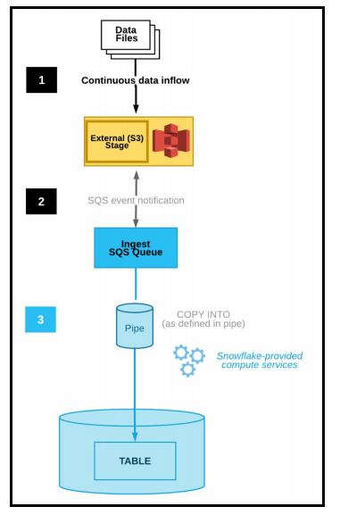

# Présentation du lab 2:  
Ce second lab démontre les fonctionnalités de Snowflake spécifiquement adaptées à la charge de travail « Data Engineering » pour créer des pipelines de données modernes. Les pipelines de données automatisent de nombreuses étapes manuelles impliquées dans la transformation et l'optimisation des charges de données continues.   

Snowflake fournit les fonctionnalités suivantes pour activer des pipelines de données continus :  
* Chargement continu des données à l'aide de Snowpipe,  
* Modifier le suivi des données à l'aide de Streams,  
* Tâches (TASKS) récurrentes.  

L'image ci-dessous illustre comment créer des pipelines de données continus avec Snowflake.  


  

Les Streams et les tasks sont des fonctionnalités qui vous permettent de créer des pipelines de données et de transformer Snowflake en un moteur  transformation de données agile en plus d’un puissant entrepôt de données.  


## Configuration de l'accès sécurisé à Amazon S3:  

Cette section décrit comment utiliser les intégrations de stockage **Storage integration* pour permettre à Snowflake de lire et d'écrire des données dans un compartiment Amazon S3 référencé dans une étape externe (c'est-à-dire S3).  

Le diagramme suivant montre le flux d'intégration pour une étape S3 :    

  

### Liste des étapes pour cette section :  

* Étape 1 : configurer les autorisations d'accès pour le compartiment S3  
    * Exigences du contrôle d'accès AWS  
    * Création d'une stratégie IAM  
* Étape 2 : Créer le rôle IAM dans AWS  
* Étape 3 : Créer une intégration de stockage cloud dans Snowflake  
* Étape 4 : Récupérer l'utilisateur AWS IAM pour votre compte Snowflake  
* Étape 5 : Accorder à l'utilisateur IAM les autorisations d'accès aux objets du compartiment S3  

Vous avez pas besoin de créer votre propre bucket S3. Le bucket qui sera utilisé dans ce lab est ** logbrain-private-datalake **. Les données seront sotckées dans le dossier **  citibike_snowpipe **.   

* Pour Configurer les autorisations d'accès pour le bucket S3. [AWS]
    Suivez les instructions décrites dans la documentation Snowflake en utilisant le lien ci-dessous.  
    https://docs.snowflake.com/en/user-guide/data-load-s3-config-storage-integration.html#step-1-configure-access-permissions-for-the-s3-bucket  

* Pour créer un role IAM,  [AWS]
    Suivez les instructions décrites dans la documentation Snowflake en utilisant le lien ci-dessous. 
    https://docs.snowflake.com/en/user-guide/data-load-s3-config-storage-integration#step-2-create-the-iam-role-in-aws  
 

* Create a Cloud Storage Integration in Snowflake.   

1. Switch Context:  
```
USE ROLE ACCOUNTADMIN;
```
2. Create the Warehouse:  
```
CREATE WAREHOUSE IF NOT EXISTS DATAPIPELINES_WH
    WITH WAREHOUSE_SIZE = 'XSMALL' 
    AUTO_SUSPEND = 60 
    AUTO_RESUME = TRUE;
```

3. Create the database and grant access to the new role create :
```
CREATE DATABASE IF NOT EXISTS CITIBIKE_PIPELINES;
```

4. Switch Context:
```
USE CITIBIKE_PIPELINES.PUBLIC;
USE WAREHOUSE DATAPIPELINES_WH;
```

5. Create the table for Trips:  
```
CREATE OR REPLACE TABLE TRIPS
(tripduration integer,
  starttime timestamp,
  stoptime timestamp,
  start_station_id integer,
  start_station_name string,
  start_station_latitude float,
  start_station_longitude float,
  end_station_id integer,
  end_station_name string,
  end_station_latitude float,
  end_station_longitude float,
  bikeid integer,
  membership_type string,
  usertype string,
  birth_year integer,
  gender integer);
```
6. Create the stage with the S3 bucket:
```
CREATE or replace STAGE CITIBIKE_PIPELINES.PUBLIC.citibike_trips URL = 's3://logbrain-datalake/citibike/';  

list @citibike_trips;  
```
7. Define the file format:
```
create or replace FILE FORMAT CITIBIKE_PIPELINES.PUBLIC.CSV 
    COMPRESSION = 'AUTO' 
    FIELD_DELIMITER = ',' 
    RECORD_DELIMITER = '\n' 
    SKIP_HEADER = 0 
    FIELD_OPTIONALLY_ENCLOSED_BY = '\042' 
    TRIM_SPACE = FALSE 
    ERROR_ON_COLUMN_COUNT_MISMATCH = TRUE 
    ESCAPE = 'NONE' 
    ESCAPE_UNENCLOSED_FIELD = '\134' 
    DATE_FORMAT = 'AUTO' 
    TIMESTAMP_FORMAT = 'AUTO' 
    NULL_IF = ('');
```

8. Load data into the table:  
```
copy into trips from @citibike_trips file_format=CSV;

Select * from TRIPS limit 10;
```

9. Truncate table TRIPS:

```
truncate table TRIPS;

Select * from TRIPS limit 10;
```


10. Set the context for worksheet :

```
USE ROLE ACCOUNTADMIN;
USE CITIBIKE_PIPELINES.PUBLIC;
USE WAREHOUSE DATAPIPELINES_WH;
```

11. Create Cloud Storage Integration:  

```
create or replace storage integration citibike_snowpipe_integration
type = external_stage
storage_provider = s3
enabled = true
storage_aws_role_arn = 'arn:aws:iam::220286917992:role/logbrain-private-datalake-role'
storage_allowed_locations = ('s3://logbrain-private-datalake/citibike_snowpipe/');
```

-- Récupérez l'utilisateur AWS IAM pour votre compte Snowflake et enregistrez les valeurs suivantes à partir de l'instruction SQL ci-dessous :     
-- STORAGE_AWS_IAM_USER_ARN   
-- STORAGE_AWS_EXTERNAL_ID   

12. Describe the storage integration: 

```
DESC INTEGRATION citibike_snowpipe_integration;
```

-- 1.7.1 Creating an External Stage. 

```
create or replace stage streaming_data
  url = 's3://logbrain-private-datalake/citibike_snowpipe/'
  storage_integration = citibike_snowpipe_integration
  file_format=(type=json);
```

13. List stages:  
```
show stages like '%STREAMING%';
```
 ## Snowpipe:

Cette section décrit l'option la plus courante pour déclencher les chargements de données Snowpipe.
automatiquement à l'aide des notifications Amazon SQS (Simple Queue Service) pour un compartiment S3.  
Le diagramme suivant montre le flux du processus d'ingestion automatique de Snowpipe :  

  

1. Les fichiers de données sont chargés dans le stage.  
2. Une notification d'événement S3 informe Snowpipe via une file d'attente SQS que les fichiers sont prêts à être transférés. Snowpipe copie les fichiers dans une file d'attente.  
3. Un entrepôt virtuel fourni par Snowflake charge les données des fichiers en file d'attente dans la cible
table basée sur les paramètres définis dans le pipe spécifié.  

14. Create a table that Snowpipe will use to write the incoming data:  

```
create or replace table trips_raw (v variant);
```

15. Create a SNOW PIPE definition:
```
create or replace pipe trips_pipe auto_ingest=true as copy into trips_raw from @streaming_data/;
```

16. Review the Snow pipe definition and make a note of the notification channel value.  

```
show pipes;
```


Copy the SQS notification Arn to the bucket notification sqs arn ** auto_ingest_sniowflake  **.

17. Create and Call the Stored procedure that generates data files:  

A partir du fichier Stored_Procedures.sql, copiez collez le code sql et exécutez le pour créer les 2 procédure sql.  

To call the steam_data procedure, run the following command:   

```
call stream_data('2018-01-01', '2018-01-01');
```

18. Verify if there are any files already in the bucket/folder/ 

```
list @streaming_data;
```

Revoir le contenu dU stage externe:    
```
select $1 from @streaming_data limit 100;

```

19. Check the status of the pipe.  

```
select system$pipe_status('trips_pipe');
```

20. Check if the data is loaded to the trips_raw table.  
``` 
select count(*) from trips_raw;
```

21. Review sample data from trips_raw table. 
```
select * from trips_raw limit 100;
```

22. Clean up the stage by calling the purge_files function.  
```
call purge_files('trips_raw', '@streaming_data/');
```

22. Truncate raw table
```
truncate table trips_raw;
```

23. Create Streams for trips and stations.  
```
create or replace stream stream_trips on table citibike_pipelines.public.trips_raw;

create or replace stream stream_stations on table citibike_pipelines.public.trips_raw;

show streams;

```

24. Load 1 day of data to test the streams.
call stream_data('2018-01-01', '2018-01-01');

25. Show the contents of the stage.  
```
list @streaming_data;

select $1 from @streaming_data limit 100;
```
26. Check the status of the pipe and watch for file create events
```
select system$pipe_status('trips_pipe');
```

27. Snowpipe copies the data into the raw table and the insertions are tracked in the stream.
```
select count(*) from citibike_pipelines.public.trips_raw;

select * from citibike_pipelines.public.trips_raw limit 100;
```
```
select count(*) from stream_trips;

select * from stream_trips limit 100;
```
28. reate tables to store the data processed by the Streams.  
```
create or replace table bike_trips (
  tripduration integer,
  starttime timestamp_ntz,
  stoptime timestamp_ntz,
  start_station_id integer,
  end_station_id integer,
  bikeid integer,
  usertype string
);
```
```
create or replace table bike_stations (
  station_id integer,
  station_name string,
  station_latitude float,
  station_longitude float,
  station_comment string
);
```

29. Create the push_trips task to read JSON data in the streams_trips stream and load to bike_trips.  

```
create or replace task push_trips 
warehouse = DATAPIPELINES_WH
schedule = '1 minute'
when system$stream_has_data('stream_trips')
as
insert into bike_trips
  select v:tripduration::integer,
  v:starttime::timestamp_ntz,
  v:stoptime::timestamp_ntz,
  v:start_station_id::integer,
  v:end_station_id::integer,
  v:bikeid::integer,
  v:usertype::string
  from stream_trips;
```

30. Create a task to perform a merge into the bike_stations table.  
```
create or replace task push_stations 
warehouse = DATAPIPELINES_WH
schedule = '1 minute'
when system$stream_has_data('stream_stations')
as
merge into bike_stations s
  using (
    select v:start_station_id::integer station_id,
      v:start_station_name::string station_name,
      v:start_station_latitude::float station_latitude,
      v:start_station_longitude::float station_longitude,
      'Station at ' || v:start_station_name::string station_comment
    from stream_stations
    union
    select v:end_station_id::integer station_id,
      v:end_station_name::string station_name,
      v:end_station_latitude::float station_latitude,
      v:end_station_longitude::float station_longitude,
      'Station at ' || v:end_station_name::string station_comment
    from stream_stations) ns
  on s.station_id = ns.station_id
  when not matched then
    insert (station_id, station_name, station_latitude, station_longitude, station_comment)
    values (ns.station_id, ns.station_name, ns.station_latitude, ns.station_longitude, ns.station_comment);
```
30. Define a TASK to call the purge_files procedure AFTER the push_trips TASK runs.  

```
create or replace task purge_files 
warehouse = DATAPIPELINES_WH
after push_trips
as
  call purge_files('trips_raw', '@streaming_data/');
```

31. Activate the tasks that were just created.
```
alter task purge_files resume;
alter task push_trips resume;
alter task push_stations resume;

show tasks;
```
32. Verify data loaded from streams to the tables.
```
select count(*) from citibike_pipelines.public.bike_trips; 

select count(*) from citibike_pipelines.public.bike_stations;
```

33. Call the stream_data procedure to drop files into the STAGE for couple of days 

```
call stream_data('2018-01-03', '2018-01-04');
```

34. Show the details of each of the tasks over the last five minutes.
```
select * from table(information_schema.task_history())
  where scheduled_time > dateadd(minute, -5, current_time())
  and state <> 'SCHEDULED'
  order by completed_time desc;
```

35. How long until the next task runs?  
```
select timestampdiff(second, current_timestamp, scheduled_time) next_run, scheduled_time, name, state
  from table(information_schema.task_history())
  where state = 'SCHEDULED' order by completed_time desc;
```


36. How many files have been processed by the pipeline in the last hour?

```
select count(*)
from table(information_schema.copy_history(
  table_name=>'citibike_pipelines.public.trips_raw',
  start_time=>dateadd(hour, -1, current_timestamp)));
```

37. query to get an overview of the pipeline including: time to next task run, the number of files in the bucket,   
-- number of files pending for loading, total number of files processed in the last hour, and record count metrics.  
-- across all the tables referenced in these labs.  

```
select
  (select min(timestampdiff(second, current_timestamp, scheduled_time))
    from table(information_schema.task_history())
    where state = 'SCHEDULED' order by completed_time desc) time_to_next_pulse,
  (select count(distinct metadata$filename) from @streaming_data/) files_in_bucket,
  (select parse_json(system$pipe_status('citibike_pipelines.public.trips_pipe')):pendingFileCount::number) pending_file_count,
  (select count(*)
    from table(information_schema.copy_history(
    table_name=>'citibike_pipelines.public.trips_raw',
    start_time=>dateadd(hour, -1, current_timestamp)))) files_processed,
  (select count(*) from citibike_pipelines.public.trips_raw) trips_raw,
  (select count(*) from citibike_pipelines.public.stream_trips) recs_in_stream,
  (select count(*) from citibike_pipelines.public.bike_trips) bike_trips,
  (select count(*) from citibike_pipelines.public.bike_stations) bike_stations,
  (select max(starttime) from citibike_pipelines.public.trips) max_date;
```

38.  Suspend the tasks using the below queries.
```
alter task push_stations suspend;
alter task push_trips suspend;
alter task purge_files suspend;
```

39.  remove the tasks using the below queries.  

```
drop task push_stations ;
drop task push_trips ;
drop task purge_files ;
```

40.  remove the streams using the below queries.  

```
drop task stream_stations ;
drop task stream_trips ;
```


41.  remove the procedures using the below queries.  

```
drop procedure purge_files ;
drop procedure stream_data ;
```

42.  remove the stage using the below queries.  

```
drop stage streaming_data ;
```

42.  remove the table using the below queries.  

```
drop table trips ;
drop table trips_raw ;
drop table bike_stations ;
drop table bike_trips ;
```