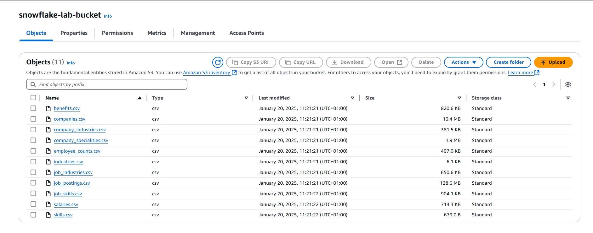
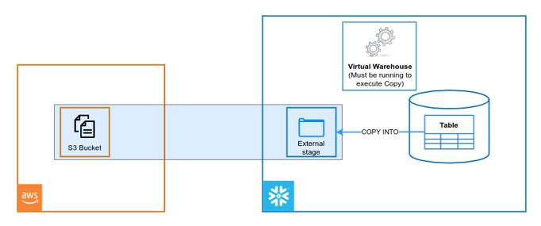

# Projet module architecture Big Data:  

Chaque jour, des milliers d'entreprises et de particuliers se tournent vers LinkedIn à la recherche de talents.  
Le jeux de données que vous allez explorer contient plus de 33 000 offres d’emploi.  
Pour pouvoir interagir avec les différents jeux de données aux formats fichiers csv et json. Vous allez commencer par charger chaque fichier dans une table de base de données Snowflake.  

Les fichiers sont dans le bucket S3 public s3://snowflake-lab-bucket/. 

Pour visualiser les données il suffit de cliquez sur le client correspondant pour téléchager le fichier sur votre ordinateur.

* https://snowflake-lab-bucket.s3.eu-west-1.amazonaws.com/benefits.csv

* https://snowflake-lab-bucket.s3.eu-west-1.amazonaws.com/companies.csv

* https://snowflake-lab-bucket.s3.eu-west-1.amazonaws.com/company_industries.csv

* https://snowflake-lab-bucket.s3.eu-west-1.amazonaws.com/company_specialities.csv

* https://snowflake-lab-bucket.s3.eu-west-1.amazonaws.com/employee_counts.csv

* https://snowflake-lab-bucket.s3.eu-west-1.amazonaws.com/industries.csv

* https://snowflake-lab-bucket.s3.eu-west-1.amazonaws.com/job_industries.csv

* https://snowflake-lab-bucket.s3.eu-west-1.amazonaws.com/job_postings.csv

* https://snowflake-lab-bucket.s3.eu-west-1.amazonaws.com/job_skills.csv

* https://snowflake-lab-bucket.s3.eu-west-1.amazonaws.com/salaries.csv

* https://snowflake-lab-bucket.s3.eu-west-1.amazonaws.com/skills.csv

## Prérequis:
* Utilisation de l'environnement d'essai gratuit de 30 jours de Snowflake.
* Connaissance de base de SQL et des concepts et objets de bases de données.
* Connaissance des formats de fichiers CSV délimités par des virgules et des formats de fichiers semi-structurées JSON.

## Indications:

* L'ensemble de l'atelier doit être réaliser à travers des scripts (pas d'utilisation des fonctionnalités de l'interface graphiques)
* Le rendu doit être sous format d'un worksheet snowflake contenant l'ensemble des commandes éxécutées durant la réalisation de l'atelier.
* Les erreurs rencontrées dans la réalisation de l'atelier doivent être documentées.
* Le choix d'une solution doit être justifié et expliqué. 

## Creation d'un compte Snowflake gratuit:

Rendez-vous sur ce lien https://trial.snowflake.com pour créer un compte Snowflake grtuit d'une durée de 30 jours.

L'édition Snowflake (Standard, Enterprise, Business Critical, etc.), pour ce lab choisissez Standard Edition.
Les fournisseurs de cloud disponible sont (AWS, Azure, GCP), pour ce lab choisissez **AWS** et la région Europe (Irlande) **eu-west-1**.  

Après votre inscription, vous recevrez un e-mail avec un lien d'activation et une URL pour accéder à votre compte Snowflake.

### Connexion à l'interface utilisateur (UI) de Snowflake:
Ouvrez une fenêtre de navigateur et saisissez l'URL de votre environnement d'essai de 30 jours Snowflake qui a été envoyée avec votre e-mail d'inscription. Vous devriez voir la boîte de dialogue de connexion suivante. Saisissez le nom d'utilisateur et le mot de passe que vous avez spécifiés lors de l'inscription :

## Chargement des données:

Présentation du jeux de données:

**Jobs_posting :**  Format CSV

|Column |                      Description  |
|--------|-----------------------------------|  
|job_id                    | The job ID as defined by LinkedIn (https://www.linkedin.com/jobs/view/{job_id})|
|company_id	               | Identifier for the company associated with the job posting (maps to companies.csv)  |
|title	                   | Job title  |
|description	           |     Job description  |
|max_salary	               | Maximum salary  |
|med_salary	               | Median salary  |
|min_salary	               | Minimum salary  |
|pay_period	               | Pay period for salary (Hourly, Monthly, Yearly)  |
|formatted_work_type	   |     Type of work (Fulltime, Parttime, Contract)  |
|location	               | Job location  |
|applies	               |     Number of applications that have been submitted  |
|original_listed_time	   | Original time the job was listed  |
|remote_allowed	           | Whether job permits remote work  |
|views	                   | Number of times the job posting has been viewed  |
|job_posting_url	       |     URL to the job posting on a platform  |
|application_url	       |     URL where applications can be submitted |  
|application_type	       | Type of application process (offsite, complex/simple onsite)  |
|expiry	                   | Expiration date or time for the job listing  |
|closed_time	           |     Time to close job listing  |
|formatted_experience_level	Job | experience level (entry, associate, executive, etc)  |
|skills_desc	           |    Description detailing required skills for job  |
|listed_time	           |   Time when the job was listed  |
|posting_domain	           | Domain of the website with application  |
|sponsored	               |Whether the job listing is sponsored or promoted  |
|work_type	               | Type of work associated with the job  |
|currency	               | Currency in which the salary is provided  |
|compensation_type	       | Type of compensation for the job  |
|scraped	               |     Has been scraped by details_retriever  |

**Salaries :**  Format CSV

|Column |                      Description  |
|--------|-----------------------------------|  
|salary_id	|The salary ID|
|job_id	The |job ID (references jobs table)|
|max_salary	|Maximum salary|
|med_salary	|Median salary|
|min_salary	|Minimum salary|
|pay_period	|Pay period for salary (Hourly, Monthly, Yearly)|
|currency	|Currency in which the salary is provided|
|compensation_type	|Type of compensation for the job (Fixed, Variable, etc)|
|salary_id	|The salary ID|

**Benefits :**  Format CSV 

|Column |                      Description  |
|--------|-----------------------------------|  
|job_id	|The job ID|
|type	|Type of benefit provided (401K, Medical Insurance, etc)|
|inferred	|Whether the benefit was explicitly tagged or inferred through text by LinkedIn|

**Companies :**  Format CSV  

|Column |                      Description  |
|--------|-----------------------------------|  
|company_id	|The company ID as defined by LinkedIn|
|name	|Company name|
|description	|Company description|
|company_size	|Company grouping based on number of employees (0 Smallest - 7 Largest)|
|country	|Country of company headquarters|
|state	|State of company headquarters|
|city	|City of company headquarters|
|zip_code	|ZIP code of company's headquarters|
|address	|Address of company's headquarters|
|url	|Link to company's LinkedIn page|

**Skills :**   Format CSV 

|Column |                      Description  |
|--------|-----------------------------------|  
|skill_abr	|The skill abbreviation (primary key)|
|skill_name	|The skill name|

**Employee_counts :**  Format CSV  

|Column |                      Description  |
|--------|-----------------------------------|  
|company_id	The |company ID|
|employee_count	|Number of employees at company|
|follower_count	|Number of company followers on LinkedIn|
|time_recorded	|Unix time of data collection|

**Job_Skills :**  Format CSV  

|Column |                      Description  |
|--------|-----------------------------------| 
|job_id	|The job ID (references jobs table and primary key)|
|skill_abr	|The skill abbreviation (references skills table)|

**Industries :**  Format CSV  

|Column |                      Description  |
|--------|-----------------------------------| 
|industry_id	|The industry ID (primary key)|
|industry_name	|The industry name|

**Job_Industries :**  Format CSV  

|Column |                      Description  |
|--------|-----------------------------------| 
|job_id	|The job ID (references jobs table and primary key)|
|industry_id	|The industry ID (references industries table)|

**Company_specialities :**  Format CSV  

|Column |                      Description  |
|--------|-----------------------------------| 
|company_id	|The company ID (references companies table and primary key)|
|speciality	|The speciality ID|

**Company_industries :**  Format CSV  

|Column |                      Description  |
|--------|-----------------------------------| 
|company_id	|The company ID (references companies table and primary key)|
|industry	|The industry ID|

Commençons par préparer le chargement des données.

Voici la liste des étapes pour charger les données dans une base de données Snowflake :

1. créez une nouvelle base de données "linkedin"

2. Créez un stage qui spécifie l'emplacement du bucket S3.  

3. Créez le file format qui correspondes à la structure des fichiers de données à charger

4. Créez les différentes tables de données en vous basant sur les discriptions ci-dessus.
 
5. Chargez les données dans tables.  

6. Effectuez les transformations si nécessaire pour rendre les données exploitable

## Analyse des données:

Avec autant de données, le potentiel d'exploration de cet ensemble de données est vaste et comprend l'exploration des titres d’emploi, des entreprises et des emplacements les mieux rémunérés et examiner comment les industries et les entreprises varient en fonction de leurs offres de emploi/stages et de leurs avantages.  

Une fois que vous avez correctement chargé les fichiers dans votre base de données, vous allez pouvoir commencez à les analyser et répondre à quelques questions :  

1.	Quel est le top 10 de job titles les plus postés ?  
2.	Quel est le job titles les mieux rémunéré (tenir compte de la devise) ?  
3.	Quelle est la répartition des offres d’emploi par taille d’entreprise ?  
4.	Quelle est la répartition des offres d’emploi par type d’industrie ?  
5.	Quelle est la répartition des offres d’emploi par type d’emploi (full-time, intership, part-time) ?  
6.	Toute nouvelle suggestion d’analyse est la bienvenue et sera considérée comme un bonus.  

## Livrable:

Le livrable attendu pour ce projet est un document qui détaille chaque étape du projet :
-	Les commandes SQL utilisées.  
-	Le problèmes/erreurs rencontrées.  
-	La solution mise en place pour corriger/résoudre le problème/erreur.  
-   Les commentaires pour expliquer chaque étapes.  

Le travail doit être réalisé par groupe de 2 et la charge répartie de manière équitable entre les membres du groupe.  
Les groupes qui me fourniront des livrables identiques seront sanctionnés.   
